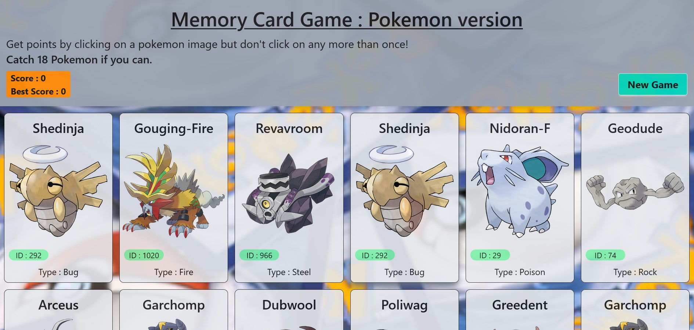

# 🧠 Pokémon Memory Card Game

Welcome to the **Pokémon Memory Card Game**! This is a fun and interactive web-based memory game where your goal is to match all the Pokémon cards without repeating a selection.

🔗 **Live Site:** [pokemon-memorycard.vercel.app](https://pokemon-memorycard.vercel.app/)

---

## 🎮 Features

- 🧩 Simple memory game mechanics
- 🎴 Random Pokémon card generation
- 💥 Score tracking system
- 🔄 Game reset functionality
- ⚡ Fast and responsive interface
- 📱 Mobile-friendly design

---

## 🛠️ Technologies Used

- **React**
- **JavaScript**
- **HTML & CSS**
- **PokéAPI** for dynamic Pokémon data
- **Vercel** for deployment

---

## 🚀 Getting Started (for developers)

### 1. Clone the repository

```bash
git clone https://github.com/h-santatra/pokemon-memorycard.git
cd pokemon-memorycard
```

### 2. Install dependencies

```bash
npm install
```

### 3. Start the development server

```bash
npm start
```

The app will run at `http://localhost:3000`.

---

## 📸 Screenshots

_Add screenshots here if needed using:_

```markdown

```

---

## 📄 License

This project is licensed under the [MIT License](LICENSE).

---

## 🙌 Acknowledgments

- Pokémon data powered by [PokéAPI](https://pokeapi.co/)
- Inspired by classic memory card games

---

Enjoy catching and matching them all! 🎉
